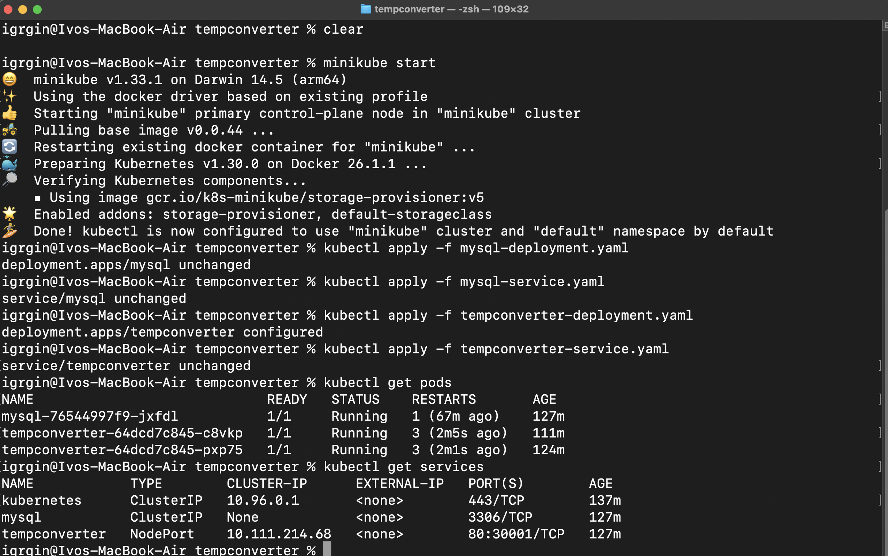

# TempConverter Project Documentation

## 1. Abstract

This project focuses on the deployment and management of containerized applications using various orchestration systems.
We aim to address the challenges of deploying the tempconverter application. The project outlines the process of 
containerizing the application and demonstrating deployment across both simple and complex systems including 
Docker Swarm and Kubernetes. The technical approach includes creating Docker images, configuring environment variables, 
and ensuring successful database connections. The goal of the project is to provide a comprehensive understanding of container
orchestration systems and their impact on deployment efficiency and scalability.

## 2. Introduction

This project explores the deployment of the tempconverter application using various container orchestration systems, 
focusing on Docker Swarm and Kubernetes. It addresses the challenge of transitioning the application from a 
non-containerized to a containerized state, ensuring it integrates seamlessly with a MySQL 8 database. By detailing the 
process of creating Docker images and configuring environment variables, this project aims to provide insights into the 
technical approaches that enhance deployment efficiency and application scalability. The comparison between simpler 
systems like Docker Swarm and more complex ones like Kubernetes will highlight their respective capabilities and 
limitations in managing containerized applications effectively.

## 3. Explanation

### Task 1: Create container image for Web application

#### Step 1: Clone the repository

The first step is to clone the repository containing the tempconverter application. This is done using the following command:

```bash
git clone https://github.com/jstanesic/tempconverter.git
cd tempconverter
```

#### Step 2: Create a Dockerfile

The Dockerfile is used to build the container image for the tempconverter application.
It contains the necessary instructions to install dependencies, copy the application files, install the required packages,
and expose the application port. At the end, the command to run the application is specified.

```Dockerfile
FROM python:3.8-slim

# Create a non-root user and group
RUN groupadd -r appgroup && useradd -r -g appgroup appuser

# Set the working directory
WORKDIR /app

# Copy the current directory contents into the container at /app
COPY . .

# Update packages and install dependencies
RUN apt-get update && apt-get install -y gcc \
    && pip install --upgrade pip \
    && pip install -r requirements.txt

# Change ownership of the /app directory to the non-root user
RUN chown -R appuser:appgroup /app

# Switch to the non-root user
USER appuser

# Expose port 5000 for the Flask app
EXPOSE 5000

# Command to run the Flask app
CMD ["python", "app.py"]
```

### Task 2: Push created image to a container registry with the tag tempconverter:latest

#### Step 1: Build the Docker image

Image is built using the following command:

```bash
podman build -t tempconverter:latest -f Dockerfile .
```


#### Step 4: Push the image to the registry
Then login to the docker.io registry using the following command:

```bash
podman login docker.io
```
Enter username and password when prompted.

Tag the image with the following command:

```bash
podman tag localhost/tempconverter:latest docker.io/igrgin/tempconverter:latest
```
Then push the image to the registry using the following command:

```bash
podman push docker.io/igrgin/tempconverter:latest
```


### Task 3: Update title configured for HTML page to have HTML title TempConverter. Create a new container image, tag it tempconverter:dev and push it to the registry

The title of the HTML page can be updated by modifying the `templates/index.html` file. The title tag can be changed to `<title>TempConverter</title>`.
After updating the title, a new container image can be created and pushed to the registry with the tag `tempconverter:dev`,
following the same steps as in Task 2.

Then, the image be built using the following command:

```bash
podman build -t tempconverter:dev -f Dockerfile .
```

#### Step 4: Push the image to the registry
Tag the image with the following command:

```bash
podman tag localhost/tempconverter:dev docker.io/igrgin/tempconverter:dev
```
Then push the image to the registry using the following command:

```bash
podman push docker.io/igrgin/tempconverter:dev
```


### Task 4: Deploy the application and database locally by using podman

#### Step 1: Create a network

First, create a network for the containers to communicate with each other. This can be done using the following command:

```bash
podman network create tempconverter-net
```

#### Step 2: Start the MySQL container

Next, start the MySQL container using the following command to start the MySQL container:

```bash
podman run -d \
  --name mysql \
  --network tempconverter-net \
  -e MYSQL_ROOT_PASSWORD=root_password \
  -e MYSQL_DATABASE=tempconverter \
  -e MYSQL_USER=tempuser \
  -e MYSQL_PASSWORD=temppass \
  docker.io/library/mysql:8.0
```

#### Step 3: Start the tempconverter container

Finally, start the tempconverter container using the following command:

```bash
podman run -d \
  --name tempconverter \
  --network tempconverter-net \
  -e DB_USER=tempuser \
  -e DB_PASS=temppass \
  -e DB_HOST=mysql \
  -e DB_NAME=tempconverter \
  -e STUDENT="Ivo Grgin" \
  -e COLLEGE="Algebra University" \
  -p 5001:5000 \
  docker.io/igrgin/tempconverter:latest
```
note: port 5001 is used to avoid conflict with the local port 5000


#### Step 4: Verify the deployment

Verify the deployment by entering the url `http://localhost:5001` in a web browser.


### Task 5: Deploy the application using simple container orchestration system

Docker Swarm will be used as the simple container orchestration system. Docker Swarm is a simple container orchestration system that allows us to deploy and 
manage containerized applications across multiple hosts.

#### Step 1: Initialize Docker Swarm

First we need to initialize Docker Swarm on the host machine. This can be done using the following command:

```bash
docker swarm init
```
#### Step 2: Deploy the application stack

Next, we need to deploy the application stack using a Docker Compose file. The `docker-compose.yml` file contains the configuration for the tempconverter application and the MySQL database.

```yaml
version: '3.8'

services:
  db:
    image: mysql:8.0
    environment:
      MYSQL_ROOT_PASSWORD: root_password
      MYSQL_DATABASE: tempconverter
      MYSQL_USER: tempuser
      MYSQL_PASSWORD: temppass
    networks:
      - tempconverter-net
    deploy:
      replicas: 1
      placement:
        constraints:
          - node.role == manager

  app:
    image: docker.io/igrgin/tempconverter:latest
    environment:
      DB_USER: tempuser
      DB_PASS: temppass
      DB_HOST: db
      DB_NAME: tempconverter
      STUDENT: "Ivo Grgin"
      COLLEGE: "Algebra University"
    ports:
      - "80:5000"
    networks:
      - tempconverter-net
    deploy:
      replicas: 2

networks:
  tempconverter-net:
    driver: overlay
```

To deploy the application stack, we can use the following command:

```bash
docker stack deploy -c docker-compose.yml tempconverter
```
#### Step 3: Verify the deployment

After successfully deploying the application stack, we can verify the deployment by entering the url `http://localhost` in a web browser
as well as checking the status of the services using the following command:

```bash
docker service ls
```


To scale up the number of app containers, we can use the following command:

```bash
docker service scale tempconverter_app=3
```


We can verify the scaling by checking the status of the services again.

### Task 8: Deploy the application using complex container orchestration system

For this task, we will deploy the tempconverter application using Kubernetes. Kubernetes is a complex container 
orchestration system that provides advanced features for deploying and managing containerized applications. 
Specifically, we will use Minikube to deploy the application locally.

Minikube is a tool that allows you to run Kubernetes clusters on a single machine. It is ideal for testing and
development purposes, but it has limitations in terms of scalability and production use.

#### Step 1: Start Minikube

First we need to start Minikube using the following command:

```bash
minikube start
```

#### Step 2: setup deployment and service for the database

First we need to create deployment and service configuration file for the MySQL database

mysql-deployment.yaml
```yaml
apiVersion: apps/v1
kind: Deployment
metadata:
  name: mysql
spec:
  replicas: 1
  selector:
    matchLabels:
      app: mysql
  template:
    metadata:
      labels:
        app: mysql
    spec:
      containers:
      - name: mysql
        image: mysql:8.0
        env:
        - name: MYSQL_ROOT_PASSWORD
          value: root_password
        - name: MYSQL_DATABASE
          value: tempconverter
        - name: MYSQL_USER
          value: tempuser
        - name: MYSQL_PASSWORD
          value: temppass
        ports:
        - containerPort: 3306
          name: mysql

```

mysql-service.yaml
```yaml
apiVersion: v1
kind: Service
metadata:
  name: mysql
spec:
  ports:
  - port: 3306
  selector:
    app: mysql
  clusterIP: None
```

#### Step 3: setup deployment and service for the tempconverter application

Then we create a deployment and service for the application.

tempconverter-deployment.yaml
```yaml
apiVersion: apps/v1
kind: Deployment
metadata:
  name: tempconverter
spec:
  replicas: 2
  selector:
    matchLabels:
      app: tempconverter
  template:
    metadata:
      labels:
        app: tempconverter
    spec:
      containers:
      - name: tempconverter
        image: igrgin/tempconverter:latest
        env:
        - name: DB_USER
          value: tempuser
        - name: DB_PASS
          value: temppass
        - name: DB_HOST
          value: mysql
        - name: DB_NAME
          value: tempconverter
        - name: STUDENT
          value: "Ivo Grgin"
        - name: COLLEGE
          value: "Algebra University"
        ports:
        - containerPort: 5000
```

tempconverter-service.yaml
```yaml
apiVersion: v1
kind: Service
metadata:
  name: tempconverter
spec:
  type: NodePort
  ports:
  - port: 80
    targetPort: 5000
    nodePort: 30001
  selector:
    app: tempconverter
```
#### Step 4: Deploy the database and application

Next, we can deploy the database and application using the following commands:

```bash
kubectl apply -f mysql-deployment.yaml
kubectl apply -f mysql-service.yaml
kubectl apply -f tempconverter-deployment.yaml
kubectl apply -f tempconverter-service.yaml
```

#### Step 5: Verify the deployment

After successfully deploying the database and application, we can verify the deployment by using the following command:

```bash
kubectl get pods 
kubectl get services
```



We can also use the following command to get the URL of the tempconverter service:

```bash
minikube service tempconverter-service --url
```
Putting the URL in a web browser will display the tempconverter application.

To scale up the number of app containers, we can use the following command:

```bash
kubectl scale deployment tempconverter --replicas=3
```


## 4. Conclusion

This project demonstrates how to build and containerize and deploy the tempconverter application using Podman, Docker Swarm and Kubernetes. It also shows how to push an image to a container registry and basics of orchestration. 

Both of the tested orchestration systems are sutible for this task, but they have their own advantages and dissadvantages.

Docker Swarm is simple and easy to use, making it a great choice for testing environments and simple deployments.

Kubernetes is a more extensible and advanced tool that is suited for production use and complex deployments.

In conclusion, both tools provide powerful solutions for container management and orchestration, ensuring that regardless of your choice, you can achieve efficient deployment and scalable application management.
